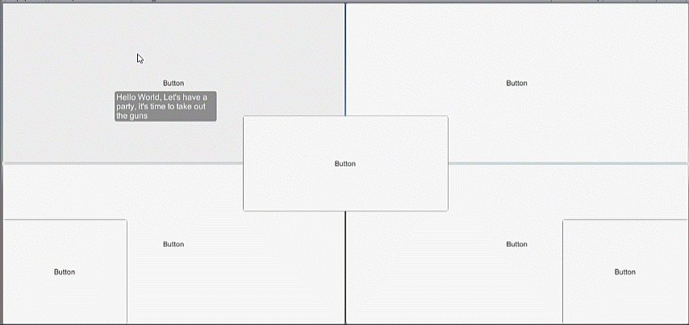

# ATips
A Tips impl. for UnityGUI

# Installation

import all the .cs files in "Assets/ATips" into your project.

# Guide

Check the "Assets/ATipsExample.unity" for how to config the tips' position & visual settings;

## Config tooltip content

* Add "ATipsTrigger" to an UI element with "Raycast Target" enabled;
* Set tooltip content in ATipsTrigger component's "Content" field in inspector;

## Tips setting

* Just copy how the tips ui element is assembled in the example scene (transform path=CanvasTips/Tips)
* The default setting will auto-position the tips around pointer;
    * If you want to customize the tips positioning, check the "FixedTips" and "BottomRightTips"

